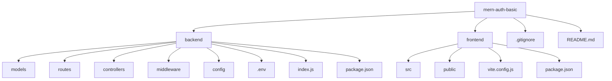

# 🚀 MERN Authentication Project

A simple authentication system built with the MERN stack. This project includes user registration and login functionalities using MongoDB, Express.js, React.js (Vite), and Node.js.

---

## 📂 Folder Structure



---

## ⚙️ Backend Setup

### 1️⃣ Initialize the Backend

✅ Created `backend` directory
✅ Ran `npm init -y` to initialize Node.js project

### 2️⃣ Installed Dependencies

✅ Express.js for server setup
✅ Mongoose for MongoDB interaction
✅ dotenv for environment variables
✅ CORS for cross-origin access
✅ bcrypt.js for password hashing
✅ JSON Web Token for authentication
✅ Nodemon (dev dependency) for auto-restarting server

### 3️⃣ Project Structure

✅ `models/` - Defines Mongoose schema for users
✅ `routes/` - Handles authentication routes (`/register`, `/login`)
✅ `controllers/` - Implements request logic
✅ `middleware/` - Contains authentication checks
✅ `config/` - Manages database connection
✅ `.env` - Stores environment variables
✅ `index.js` - Entry point for Express server

### 4️⃣ API Implementation

✅ User registration: Hashes passwords and saves users in MongoDB
✅ User login: Verifies passwords and issues JWT tokens
✅ Middleware: Protects routes with authentication checks

---

## 🔥 Next Steps: Frontend Setup

🔹 Create React app with Vite
🔹 Design login and registration pages
🔹 Connect frontend with backend APIs

---

## 🚀 How to Run the Project

### Clone the Repository

```sh
git clone https://github.com/yourusername/mern-auth-basic.git
cd mern-auth-basic
```

### Start the Backend

```sh
cd backend
npm install
npm run dev
```

### Start the Frontend (once implemented)

```sh
cd frontend
npm install
npm run dev
```

💡 Stay tuned for the frontend implementation!
